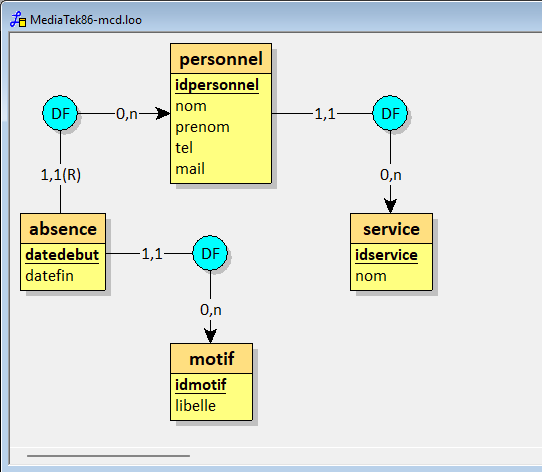
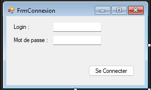
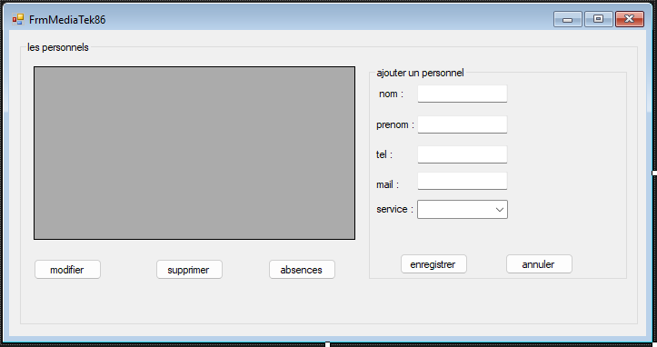
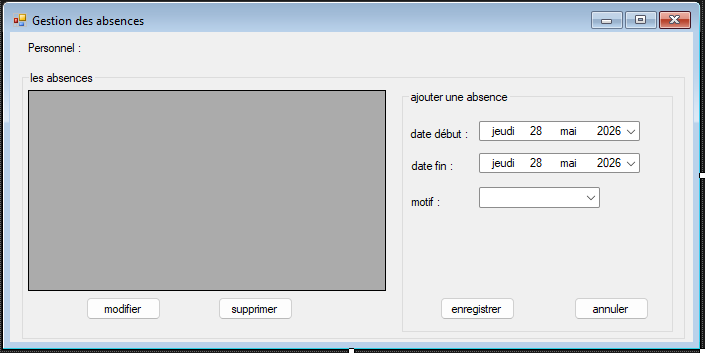
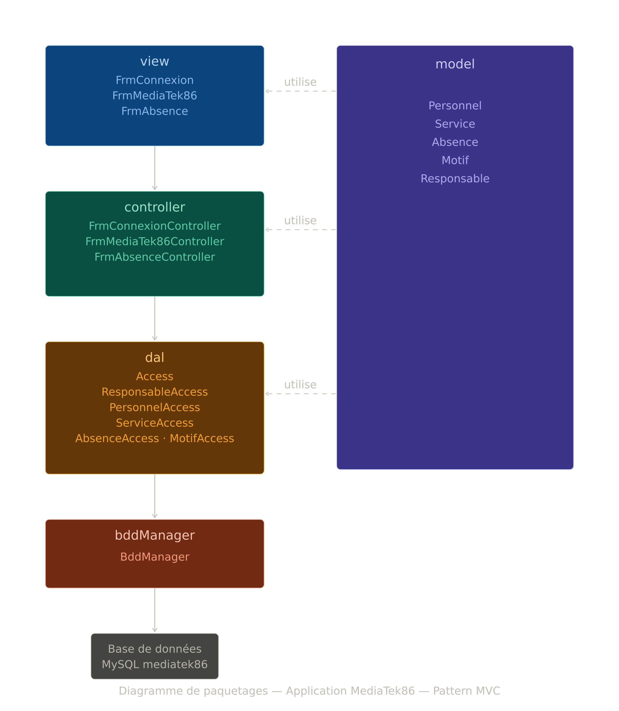

# Application MediaTek86

Application C# écrite sous Visual Studio 2022 Entreprise et exploitant une BDD MySQL.

## Présentation de l'application

### Présentation du contexte

Le client est le réseau MediaTek86, qui gère les médiathèques de la Vienne. L'ESN fictive 
InfoTech Services 86 a développé une application interne pour gérer le personnel des médiathèques. 
Cette application permet de gérer les agents (nom, prénom, téléphone, mail, service) ainsi que 
leurs absences (date de début, date de fin, motif). L'accès à l'application est sécurisé par 
un système d'authentification.

### But de l'application

Le responsable souhaite avoir un utilitaire pour gérer le personnel des médiathèques et leurs absences.

L'application doit permettre de :

- authentifier le responsable
- présenter la liste du personnel (nom, prénom, téléphone, mail, service)
- ajouter, modifier ou supprimer un agent
- présenter la liste des absences d'un agent
- ajouter, modifier ou supprimer une absence

### Structure de la BDD

Voici le schéma conceptuel de données présentant la structure de la BDD qui est au format MySQL :

### Interfaces

Voici les interfaces de l'application :

**Formulaire de connexion**

**Formulaire principal - Gestion du personnel**

**Formulaire des absences**

### Diagramme de paquetage

L'application est structurée dans le respect du pattern MVC.

#### Explications sur les couches supplémentaires

L'application contient 2 paquetages supplémentaires par rapport au MVC classique :

- **bddManager** : contient BddManager, la classe qui permet d'accéder à la base de données 
MySQL et d'exécuter les requêtes. C'est une classe indépendante et réutilisable.
- **dal** (Data Access Layer) : contient Access, ResponsableAccess, PersonnelAccess, 
ServiceAccess, AbsenceAccess et MotifAccess. Répond aux demandes du paquetage controller 
et exploite bddManager en lui demandant d'exécuter des requêtes.

L'avantage de cette architecture est l'isolement de la connexion (bddManager) par rapport 
au reste de l'application. Le contrôleur ne sait pas d'où viennent les données. Le paquetage 
dal fait l'intermédiaire en préparant des requêtes SQL.

Changer de SGBDR reviendrait à juste changer la classe BddManager. Changer de type de fichier 
reviendrait à changer les classes du paquetage dal, sans toucher au reste de l'application.

Le paquetage **model** contient les classes métier : Personnel, Service, Absence, Motif 
et Responsable. Ces classes correspondent aux tables de la base de données et ne contiennent 
que la structure des données (propriétés, getters, setters).

Le paquetage **controller** contient FrmConnexionController, FrmMediaTek86Controller et 
FrmAbsenceController. Chaque contrôleur est dédié à sa vue et fait le lien entre la vue 
et la couche dal.

Le paquetage **view** contient FrmConnexion, FrmMediaTek86 et FrmAbsence. Chaque vue 
ne contient que le code d'affichage et les événements, sans aucun accès direct aux données.

#### Présentation du cheminement

L'application démarre sur FrmConnexion. La vue crée une instance du contrôleur qui lui est dédié. 
Quand elle a besoin d'accéder aux données, elle fait appel à son contrôleur. Le contrôleur fait 
appel aux classes de la couche dal pour exécuter les demandes de la vue. Les classes de la couche 
dal contiennent les requêtes SQL et sollicitent la couche bddManager pour les exécuter.

---

## Etapes de construction

Les différents commits montrent la création de l'application étape par étape.

### Commit "Étape 2 : création des packages MVC et visuel des interfaces"

La structure de l'application est créée (les paquetages et classes), dans le respect du 
diagramme de paquetage. Les formulaires sont créés visuellement sans code métier. 
L'application n'est pas encore opérationnelle.

### Commit "Étape 3 : modèle, BddManager, Access et documentation technique"

Les classes du modèle sont codées (Personnel, Service, Absence, Motif, Responsable). 
Les classes BddManager et Access sont codées. La documentation technique est générée 
avec SandCastle SHFB.

### Commit "CU1 : Se connecter"

Implémentation de l'authentification du responsable. Création de ResponsableAccess, 
FrmConnexionController et code métier de FrmConnexion.

### Commit "CU2 : Ajouter un personnel"

Implémentation de l'ajout d'un personnel. Création de PersonnelAccess, ServiceAccess, 
FrmMediaTek86Controller et code métier de FrmMediaTek86.

### Commit "CU3 : Modifier un personnel"

Implémentation de la modification d'un personnel existant. Ajout de la méthode 
UpdatePersonnel dans PersonnelAccess.

### Commit "CU4 : Supprimer un personnel"

Implémentation de la suppression d'un personnel. Ajout de la méthode DelPersonnel 
dans PersonnelAccess.

### Commit "CU5 : Afficher les absences"

Implémentation de l'affichage des absences d'un personnel. Création de AbsenceAccess, 
MotifAccess, FrmAbsenceController et code métier de FrmAbsence.

### Commit "CU6 : Ajouter une absence"

Implémentation de l'ajout d'une absence. Ajout de la méthode AddAbsence dans AbsenceAccess.

### Commit "CU7 : Modifier une absence"

Implémentation de la modification d'une absence. Ajout de la méthode UpdateAbsence 
dans AbsenceAccess.

### Commit "CU8 : Supprimer une absence"

Implémentation de la suppression d'une absence. Ajout de la méthode DelAbsence 
dans AbsenceAccess.

---

## Installation

Pour tester l'application dans un environnement de développement, il faut installer :

- WampServer avec MySQL actif
- Visual Studio 2022 avec .NET Framework 4.8
- Package NuGet MySql.Data

Ensuite :

1. Exécuter le script `mediatek86.sql` dans phpMyAdmin pour créer et remplir la BDD
2. Ouvrir `MediaTek86.sln` dans Visual Studio 2022
3. Lancer l'application
4. Se connecter avec le login `admin` et le mot de passe `Admin2026`
